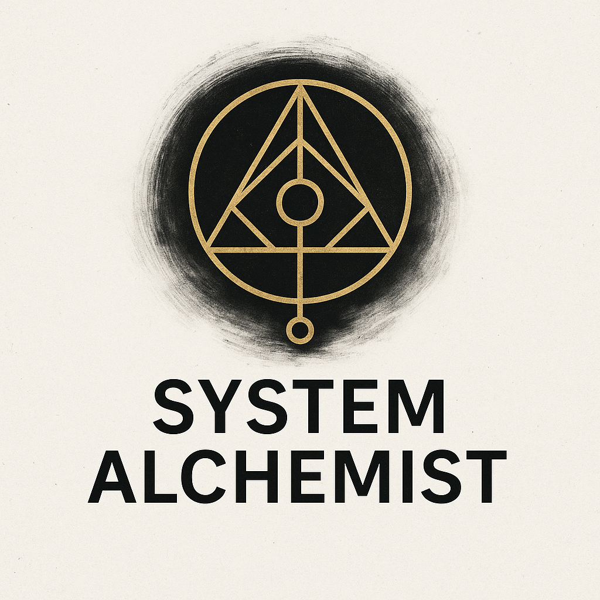

# 🧪 System Alchemist

**Turning architecture into art. Systems into soul.**

A manifesto and method for designing software systems in 2025 — where human intention meets machine execution.

---

## 🔷 Core Philosophy

**Human-Led Architecture. AI-Powered Implementation.**

- Define **bounded contexts** using Domain-Driven Design (DDD)
- Generate infrastructure + logic inside each context with AI agents
- Deliver **momentum**, not micromanagement
- Design for **evolution**, not just stability
- Bring in soul: rhythm, paradox, asymmetry, beauty

> “We are not here to tame chaos. We are here to compose it.”

---

## 🧠 Operating Stack

| Layer            | Role                                |
|------------------|-------------------------------------|
| Strategic Design | DDD, event flows, core domains      |
| System Alchemy   | Architecture decisions + context maps |
| AI Agents        | Generate code, tests, infra, scaffolds |
| Human Reviews    | High-value thinking, integration, empathy |

---

## ✨ Principles

- **Momentum is clarity in motion.**
- **Context is the boundary of power.**
- **Abstraction is not detachment.**
- **Ambiguity is sacred, but not permanent.**
- **Every system is a poem in disguise.**

---

## 🌌 Visual Style

- Typeface: `IBM Plex` (rational meets expressive)
- Colors: Charcoal, amber, indigo
- Imagery: Fractals, sacred geometry, layered blueprints
- Logo: 

---

## 📂 Artifacts

- [`System_Design_Manifesto_2025.pdf`](./System_Design_Manifesto_2025.pdf)
- [`Leadership_Stack_Visual.pdf`](./Leadership_Stack_Visual.pdf)
- (Coming soon) “AI Rituals for Each Context” — code + commentary

---

## 📜 License

Free to remix under [Creative Commons BY-SA](https://creativecommons.org/licenses/by-sa/4.0/).  
Use it. Break it. Rebuild it beautifully.

---

## ☯️

> *“The system is not separate from you.  
> You are the rhythm by which it moves.”*
